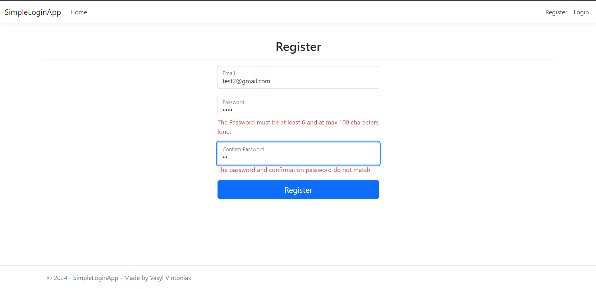
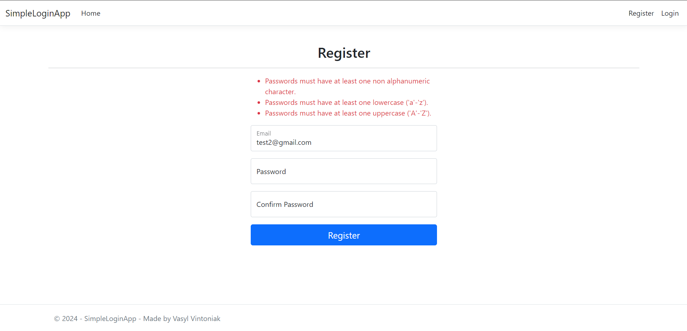
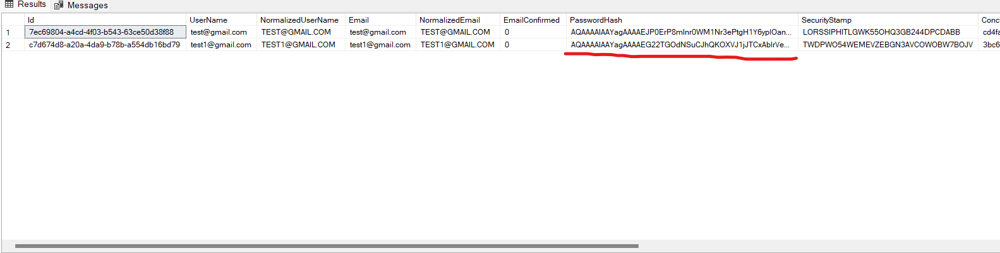

# SimpleLoginApp

## Цей репозиторій створений для Лабораторної роботи №3.

### Завдання 1 (3 балів)

Розробити парольну систему (на будь-якій мові реалізувати найпростішу сторінку реєстрації і входу, можливо із використанням фреймворку). Пароль повинен відповідати такій політиці:

1. Довжина паролю повинна бути не менше 8 символів.
2. Пароль повинен включати великі і малі літери.
3. Пароль повинен містити цифру.
4. Пароль повинен містити символ (не літеру і не цифру).

Ознайомитись з алгоритмом хешування, який будете використовувати для зберігання паролів при реєстрації користувача.

При вході у систему забезпечити спочатку індентифікацію користувача, якщо такого нема у системі, то виводити відповідне повідомлення і переправляти на сторінку реєстрації. Аутентифікація відбувається по рівності хешів.

---

* **Перевірка на співпадіння паролів:**
  
* Показано помилку, що не всі правила створення паролю виконано(у поле було введено 12341234, тобто цифри теж потрібні):
  
* Скріншот з бази даних, де показано роботу хешування паролів:
  

---

### Завдання 2 (2 бали)

Реалізувати механізм CAPTCHA для захисту від ботів при реєстрації акаунту.

---

---

### Завдання 3 (2 бали)

Реалізувати активацію облікового запису користувача, наприклад через електронну почту.

---

---

### Завдання 4 (2 бали)

Передбачити обмеження на кількість неправильно введених даних підряд. Імплементувати логування спроб входу, щоб адміністратори могли бачити, хто намагався увійти в систему і скільки разів.

---

---

### Завдання 5 (2 балів)

Імплементувати двохфакторну аутентифікацію 2FA (на вибір). Користувач має мати можливість у своєму профілі включати/виключати цю опцію.

---

---

### Завдання 6 (2 балів)

Добавити вхід через сторонні сервіси OAuth (на вибір)

---

---

### Завдання 7 (2 балів)

Додати функціонал для відновлення пароля через електронну пошту, включаючи генерацію токена для підтвердження особи. Додайте обмеження на термін дії токена.

---

---
